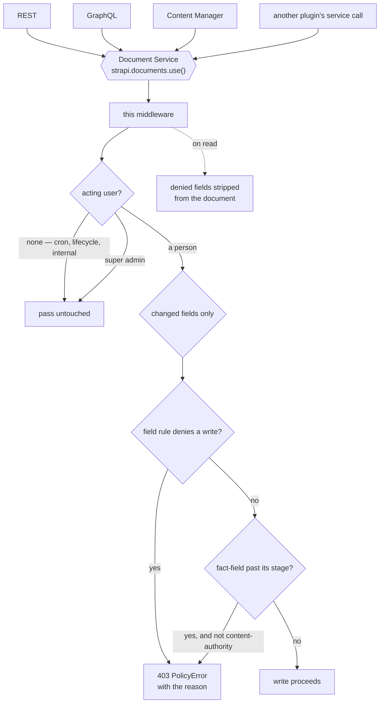
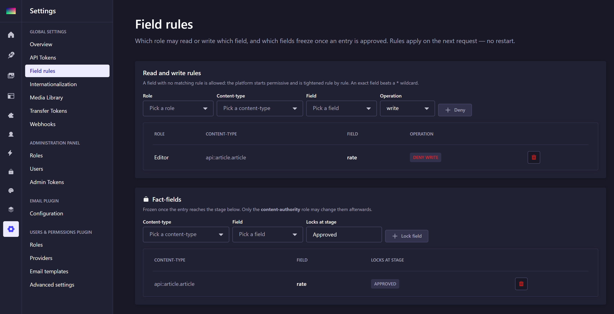

# strapi-plugin-rbac

[](https://www.npmjs.com/package/strapi-plugin-rbac)    

Field-level access control for Strapi 5: **which role may read or write which field**, plus
a **fact-field lock** that freezes approved values.

Strapi's own RBAC stops at the content-type. This narrows it to the field, and adds the rule
that actually matters editorially — a rate or a disclaimer signed off at approval must not
change quietly afterwards.

One of a family of standalone Strapi 5 plugins — see [the others](https://github.com/rhyoharianja?tab=repositories).

> **This plugin intercepts core behaviour.** Re-run its regression suite on every Strapi
> upgrade — see [Regression tests](#regression-tests).

## Install

```bash
pnpm add strapi-plugin-rbac
```

```ts
// config/plugins.ts
export default {
  'rbac': {
    enabled: true,
    resolve: 'strapi-plugin-rbac',
  },
};
```

> **Keep the key `rbac` exactly as it is.** It is the plugin id, and the id is
> compiled into the package — the admin menu link, the `plugin::rbac.*`
> custom-field uids, the route prefix and every internal `strapi.plugin(...)` lookup.
> Renaming it does not rename those, so the plugin half-loads and fails in ways that do
> not look like a naming problem. `resolve` points at the package; the key does not.

The [content-workflow plugin](https://github.com/rhyoharianja/strapi-plugin-workflow) is an **optional**
peer: field rules work without it, only the fact-field lock needs a stage to key off.

## Where it intercepts, and why

Enforcement is a **document-service middleware**, registered in `register()`.

That is the right seam in Strapi 5: every path that touches content — REST, GraphQL, the
Content Manager, another plugin's service call — goes through the Document Service. A route
policy would only cover the routes it is attached to and would leave the admin's own
endpoints unguarded, which is precisely where editors work.



The middleware itself decides nothing. It gathers three things — the acting user, the rules,
the entry's stage — and hands plain values to pure functions in
[`enforcement.ts`](server/src/services/enforcement.ts). That split is what makes the rules
testable without booting Strapi.

## Two independent gates

### Field rules

`role × content-type × field × operation`, stored as data and editable in the GUI.

- **A field with no matching rule is allowed.** The platform starts permissive and is
  tightened rule by rule; a default-deny model would break every existing content-type the
  moment the plugin is installed.
- An exact field beats a `*` wildcard.
- Only **changed** fields are judged. Re-saving a form that merely *displays* a restricted
  field is fine — otherwise a role that cannot edit `rate` could never save that
  content-type at all.
- **Writes are rejected; reads are stripped.** Silently dropping a field an editor typed
  would let them believe a change was saved. Refusing a whole document because one field is
  restricted would make a list view unusable.

> Read-stripping happens inside the Document Service, so a stripped field is absent
> **everywhere** — including from other plugins and from Strapi's own internals, not just
> from the API response. Add read rules deliberately; write rules are the safer default.

### Fact-fields

A field frozen once its entry reaches a stage (default `Approved`). Only the
`content-authority` role may change it afterwards.

Independent of the role rules on purpose: a field is often freely editable **and** frozen
after approval, and folding the two together would misrepresent both.

### Neither applies to automation

A write with no acting user — a cron flow, a lifecycle, an internal service call — passes
untouched. `strapi.requestContext` is an AsyncLocalStorage store, so it is empty outside an
HTTP request, and that absence is read as "no person did this". Automation is not a role: a
scheduled take-down that could not set a locked field would be a worse failure than the one
being prevented.

Super admins bypass both gates.

## Where it lives

Field rules are edited in **Settings → Field rules**, in the same section as Roles and
Users. They are not a separate feature but an extra dimension of a role, so they sit beside
the thing they extend rather than in a top-level menu of their own.

The plugin also adds a **Roles** entry to the sidebar, pointing at Strapi's own
`/settings/roles` page — a shortcut to the page rather than a reimplementation of it. Note
that it cannot be *removed* from Settings: `addSettingsLink` only adds, and Strapi exposes no
way to take an entry out of its own settings menu. Roles is therefore reachable from both
places.

## Admin



Add or remove rules and fact-fields, with pickers for roles, content-types and their fields.
Every write invalidates the middleware's in-memory cache, so a rule takes effect on the
**next request** — no restart.

### Using it

**A field one role must not change.** Add a rule: role `strapi-editor`, content-type
`api::product.product`, field `rate`, operation `write`. That role can still open and save the
entry; only a changed `rate` is refused, with the reason.

**A value that must not drift after sign-off.** Add a fact-field: content-type
`api::product.product`, field `rate`, locked from stage `Approved`. From that stage onward only
`content-authority` may change it — regardless of any field rule, because the two gates are
independent.

**Reads.** Prefer write rules. A read rule strips the field inside the Document Service, so it
is absent *everywhere* — including from other plugins and Strapi's internals, not only from the
API response.

Both the settings page and the sidebar shortcut are gated on `admin::roles.read`. Field rules
are part of what a role means, so they belong behind the same permission; the earlier
`permissions: []` showed them to every authenticated user, including ones with no business
knowing how access is shaped.

The cache exists because the middleware runs on every document operation; re-querying two
tables per write would tax the whole application for data that changes a few times a month.

## The rejection message reaches the editor

The plugin throws an `errors.PolicyError` carrying the exact reason, for example:

```
role(s) [strapi-editor] may not write rate
rate is a fact-field locked at stage "Approved" — only the content-authority role may change it
```

That text arrives in the browser, in the `message` of a 403.

> **Correction.** This section previously stated that Strapi replaces the message with a
> generic `"Forbidden"` and that a plugin cannot override it. The first half is true of
> `ForbiddenError` — `createAuthorizeMiddleware` catches it and answers `ctx.forbidden()` with
> no detail — but the conclusion was wrong. Strapi's own source names the exception:
>
> ```js
> if (error instanceof errors.ForbiddenError) {
>   // allow PolicyError as an exception to throw a publicly visible message in the API
>   if (error instanceof errors.PolicyError) throw error;
>   return ctx.forbidden();
> }
> ```
>
> `PolicyError` extends `ForbiddenError`, so the status stays 403 and the message survives.
> Proven by making the identical refusal twice: as `ForbiddenError` it returned `"Forbidden"`,
> as `PolicyError` it returned the real text.

The reason is still logged as well, tagged `[rbac] denied …`, so a refusal
can be traced after the fact.

## Regression tests

```bash
pnpm --filter strapi-plugin-rbac test
```

26 tests over the pure enforcement logic: rule matching, wildcards, changed-field detection,
the fact-field lock, the Content Authority exemption, system writes, and read-stripping.

**Re-run them on every Strapi upgrade.** The plugin hooks into the Document Service, so a
change to how Strapi shapes a payload, reports the acting user, or orders its middlewares
can quietly weaken these rules without anything failing loudly. The tests pin the decisions;
the boundary they rest on is:

| Assumption | Where it comes from |
| ---------- | ------------------- |
| `strapi.documents.use()` sees every content write | `@strapi/core` document-service middleware |
| `context.action` is `create` / `update` on writes | same |
| `context.params.data` holds the payload | same |
| `strapi.requestContext.get()` returns the Koa ctx, or nothing outside a request | `@strapi/core` AsyncLocalStorage |
| `ctx.state.user.roles[].code` identifies the admin role | `@strapi/admin` |

If an upgrade changes any of these, the unit tests still pass while enforcement silently
stops — so check them too.

## Support

These plugins are free and MIT-licensed. If one saved you a day of work, you are welcome to
say thanks:

[](https://www.paypal.com/paypalme/sgkharianja)
[](https://saweria.co/rhioharianja)

Bug reports and pull requests are worth just as much.

## License

MIT © Suryo Galih Kencana Harianja
